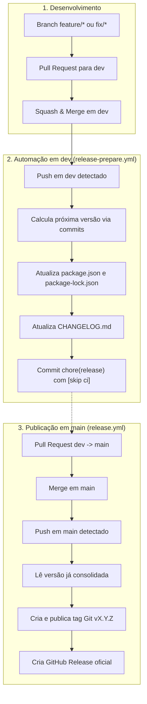

# Fluxo de Versionamento e Releases

Este documento descreve a estratégia de versionamento semântico, geração automatizada de changelog e o ciclo de vida de releases do **ShelfBox**.

---

## Filosofia

O fluxo de versionamento adota os princípios de **Continuous Integration / Continuous Delivery (CI/CD)** com **Semantic Versioning (SemVer)**:

- **Evolução contínua em `dev`**: A branch `dev` sempre reflete o estado atual do projeto. A cada nova funcionalidade ou correção integrada via PR, a versão no `package.json` e o `CHANGELOG.md` são atualizados automaticamente, sem gerar tags ou publicações prematuras.
- **Publicação limpa e atômica em `main`**: A branch `main` representa exclusivamente código em produção/lançado. Ao receber a promoção da `dev`, ela já recebe os artefatos de versão prontos, necessitando apenas criar a tag Git e a GitHub Release correspondente, garantindo histórico linear e sincronizado entre as branches.
- **Zero loops e sem divergência**: O uso de `[skip ci]` e checagens de idempotência garantem que a automação não entre em execuções redundantes no GitHub Actions.

---

## Visão Geral do Ciclo



---

## Convenção de Commits e Impacto no SemVer

O versionamento é calculado pelo [Semantic Release](https://semantic-release.gitbook.io/) com base nos [Conventional Commits](https://www.conventionalcommits.org/):

| Prefixo do Commit | Exemplo | Impacto no SemVer | Aparece no Changelog? |
|---|---|---|---|
| `feat:` | `feat: adds collection icons` | **Minor** (`0.1.0` → `0.2.0`) | Sim (Features) |
| `fix:` | `fix: normalize filename casing` | **Patch** (`0.1.0` → `0.1.1`) | Sim (Bug Fixes) |
| `perf:` | `perf: improve dexie query speed` | **Patch** (`0.1.0` → `0.1.1`) | Sim (Performance) |
| `BREAKING CHANGE:` | `feat!: rewrite collection structure` | **Major** (`0.1.0` → `1.0.0`) | Sim (Breaking Changes) |
| `chore:`, `ci:`, `docs:`, `test:`, `style:` | `chore(ci): update workflow` | **Nenhum** | Não (filtrado na convenção) |

> [!NOTE]
> Enquanto o projeto estiver na fase inicial `0.x.x`, incrementos do tipo `feat:` elevam a versão minor (ex: `0.1.0` → `0.2.0`), preservando a estabilização da API antes da versão `1.0.0`.

---

## Detalhamento dos Workflows

### 1. `release-prepare.yml` (Branch `dev`)
* **Gatilho:** `push` na branch `dev` (após o merge de PRs de features ou fixes).
* **Responsabilidade:**
  1. Executa `scripts/get-next-version.mjs` para calcular a versão a partir dos commits desde a última tag Git.
  2. Valida se a versão atual do `package.json` já é igual à calculada (evita trabalho redundante).
  3. Atualiza `package.json` e `package-lock.json` via `npm version "$VERSION" --no-git-tag-version`.
  4. Executa `conventional-changelog -p angular` atualizando o arquivo `CHANGELOG.md`.
  5. Commita e envia as alterações para `dev` com a mensagem `chore(release): v${VERSION} [skip ci]`.

### 2. `release.yml` (Branch `main`)
* **Gatilho:** `push` na branch `main` (após a aprovação e merge do PR `dev -> main`).
* **Responsabilidade:**
  1. Lê a versão já consolidada do `package.json`.
  2. Cria a tag Git `v${VERSION}` e a envia ao repositório remoto.
  3. Cria a **GitHub Release** oficial contendo o apontamento para a tag e as release notes.
  4. Não cria commits adicionais na branch `main`, garantindo que `main` e `dev` permaneçam em sincronia.

---

## Passo a Passo para o Desenvolvedor

1. **Desenvolver na branch de trabalho:**
   ```bash
   git checkout -b feature/nova-funcionalidade
   # Faça as alterações e commits seguindo o padrão
   git commit -m "feat: adiciona nova funcionalidade"
   ```
2. **Abrir PR para `dev`:**
   * O CI executará os testes, typecheck e linter.
   * Faça o **Squash and Merge** para a branch `dev`.
3. **Acompanhar a evolução em `dev`:**
   * O workflow atualizará automaticamente a versão e o `CHANGELOG.md` na branch `dev`.
4. **Promover para `main` (Release):**
   * Abra um PR de `dev` para `main`.
   * Faça o merge para `main`.
   * A tag Git e a GitHub Release serão criadas automaticamente.
