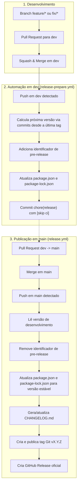

# Fluxo de Versionamento e Releases

Este documento descreve a estratégia de versionamento semântico, geração automatizada de changelog e o ciclo de vida de releases do **ShelfBox**.

---

## Filosofia

O fluxo de versionamento adota os princípios de **Continuous Integration / Continuous Delivery (CI/CD)** com **Semantic Versioning (SemVer)** e versões de **pre-release**:

* **Evolução contínua em `dev`**: A branch `dev` sempre reflete o estado atual do projeto. A cada nova funcionalidade ou correção integrada via PR, a versão de desenvolvimento no `package.json` é recalculada automaticamente com base nos commits desde a última release estável. A versão utiliza o identificador de pre-release, como `0.2.0-dev.1`, `0.2.0-dev.2` etc.
* **Versão estável em `main`**: A branch `main` representa exclusivamente código oficialmente lançado. Ao receber a promoção da `dev`, a versão de pre-release é consolidada na respectiva versão estável, como `0.2.0-dev.5` → `0.2.0`.
* **Versionamento baseado no histórico**: A próxima versão SemVer não é definida previamente. Ela é calculada automaticamente a partir dos commits desde a última release estável. Dessa forma, um `BREAKING CHANGE` pode elevar a próxima versão de `0.2.0` para `1.0.0` durante o ciclo de desenvolvimento sem necessidade de intervenção manual.
* **Pre-release como estado de desenvolvimento**: As versões `*-dev.N` identificam estados intermediários da próxima release e não geram tags ou GitHub Releases. A tag oficial somente é criada quando a alteração chega à `main`.
* **Zero loops e sem divergência**: O uso de `[skip ci]` e checagens de idempotência garante que a automação não entre em execuções redundantes no GitHub Actions.

---

## Visão Geral do Ciclo



---

## Convenção de Commits e Impacto no SemVer

O versionamento é calculado pelo **Semantic Release** com base nos **Conventional Commits**:

| Prefixo do Commit                           | Exemplo                               | Impacto no SemVer             | Aparece no Changelog?       |
| ------------------------------------------- | ------------------------------------- | ----------------------------- | --------------------------- |
| `feat:`                                     | `feat: adds collection icons`         | **Minor** (`0.1.0` → `0.2.0`) | Sim (Features)              |
| `fix:`                                      | `fix: normalize filename casing`      | **Patch** (`0.1.0` → `0.1.1`) | Sim (Bug Fixes)             |
| `perf:`                                     | `perf: improve dexie query speed`     | **Patch** (`0.1.0` → `0.1.1`) | Sim (Performance)           |
| `BREAKING CHANGE:`                          | `feat!: rewrite collection structure` | **Major** (`0.1.0` → `1.0.0`) | Sim (Breaking Changes)      |
| `chore:`, `ci:`, `docs:`, `test:`, `style:` | `chore(ci): update workflow`          | **Nenhum**                    | Não (filtrado na convenção) |

> [!NOTE]
> Enquanto o projeto estiver na fase inicial `0.x.x`, incrementos do tipo `feat:` elevam a versão minor (ex: `0.1.0` → `0.2.0`), preservando a estabilização da API antes da versão `1.0.0`.

> [!IMPORTANT]
> A versão calculada representa a próxima **versão estável**, enquanto a branch `dev` utiliza o mesmo número de versão acompanhado pelo identificador de pre-release. Por exemplo, se os commits desde `v0.1.0` determinarem `0.2.0`, a `dev` poderá utilizar `0.2.0-dev.1`. Caso um `BREAKING CHANGE` seja integrado posteriormente, o cálculo poderá ser atualizado para `1.0.0-dev.N`.

---

## Versionamento de Pre-release

As versões de desenvolvimento seguem a especificação SemVer utilizando o identificador `dev`:

```text
0.2.0-dev.1
0.2.0-dev.2
0.2.0-dev.3
...
```

Essas versões representam estados intermediários da próxima release e **não correspondem a releases oficiais**.

O número da versão estável (`0.2.0`, por exemplo) continua sendo determinado automaticamente pelo histórico de commits desde a última release estável.

### Exemplo

A última release estável é:

```text
v0.1.0
```

A `dev` recebe alterações:

```text
feat: adds collection icons
fix: resolves orphan images
feat: adds miniature search
```

O Semantic Release determina que o próximo incremento é:

```text
0.2.0
```

A versão de desenvolvimento passa a ser:

```text
0.2.0-dev.1
```

Novas alterações podem gerar novos estados:

```text
0.2.0-dev.2
0.2.0-dev.3
0.2.0-dev.4
```

Se durante o ciclo for introduzido um `BREAKING CHANGE`, o cálculo poderá mudar:

```text
0.2.0-dev.4
      ↓
1.0.0-dev.5
```

Não é necessário definir previamente qual será a versão final do ciclo.

Quando a `dev` for promovida para `main`, o identificador de pre-release é removido:

```text
1.0.0-dev.5
      ↓
1.0.0
```

Apenas nesse momento a tag oficial e a GitHub Release são criadas.

---

## Detalhamento dos Workflows

### 1. `release-prepare.yml` — Branch `dev`

* **Gatilho:** `push` na branch `dev`, após o merge de PRs de features ou fixes.
* **Responsabilidade:**

  1. Identifica a última tag de release estável.
  2. Analisa os commits desde essa tag.
  3. Calcula a próxima versão SemVer utilizando o Semantic Release.
  4. Adiciona o identificador de pre-release e seu respectivo número.
  5. Atualiza `package.json` e `package-lock.json` com a versão de desenvolvimento.
  6. Commita e envia as alterações para `dev` com a mensagem `chore(release): v${VERSION} [skip ci]`.

> O `CHANGELOG.md` não é atualizado na `dev`; ele é gerado apenas em `main`, no momento da release estável.

Exemplo:

```text
Última release:
v0.1.0

Alterações acumuladas:
feat
feat
fix

Próxima versão estável calculada:
0.2.0

Versão da dev:
0.2.0-dev.1
```

Uma nova alteração integrada posteriormente poderá gerar:

```text
0.2.0-dev.2
```

O processo não cria tags nem GitHub Releases.

---

### 2. `release.yml` — Branch `main`

* **Gatilho:** `push` na branch `main`, após a aprovação e merge do PR `dev -> main`.
* **Responsabilidade:**

  1. Lê a versão de pre-release consolidada no `package.json`.
  2. Remove o identificador de pre-release, obtendo a versão estável correspondente.
  3. Atualiza `package.json` e `package-lock.json` para a versão estável.
  4. Gera/atualiza o `CHANGELOG.md` com as alterações desde a última release.
  5. Commita as alterações com a mensagem `chore(release): v${VERSION} [skip ci]`.
  6. Cria e publica a tag Git `v${VERSION}`.
  7. Cria a **GitHub Release** oficial contendo o apontamento para a tag e as release notes.
  8. Garante que a versão publicada corresponda ao estado promovido pela `dev`.

Exemplo:

```text
dev:
0.2.0-dev.4

       ↓ PR dev -> main

main:
0.2.0

       ↓

tag:
v0.2.0
```

---

## Passo a Passo para o Desenvolvedor

### 1. Desenvolver na branch de trabalho

```bash
git checkout -b feature/nova-funcionalidade

# Faça as alterações e commits seguindo o padrão
git commit -m "feat: adiciona nova funcionalidade"
```

### 2. Abrir PR para `dev`

O CI executará os testes, typecheck, linter e build.

Após a aprovação, utilize **Squash and Merge** para integrar a alteração à `dev`.

### 3. Acompanhar a evolução em `dev`

Após o merge, o workflow de preparação de release será executado automaticamente.

A versão da `dev` será atualizada para um estado de pre-release:

```text
0.2.0-dev.1
0.2.0-dev.2
0.2.0-dev.3
...
```

A versão estável continua sendo determinada automaticamente pelo conjunto de commits desde a última release.

### 4. Promover para `main`

Quando o estado atual da `dev` estiver pronto para ser lançado:

1. Abra um PR de `dev` para `main`.
2. Aguarde a execução do CI.
3. Faça o merge para `main`.

O workflow de release será executado automaticamente e:

```text
0.2.0-dev.N
       ↓
0.2.0
       ↓
v0.2.0
       ↓
GitHub Release
```

A `main` passa então a representar a nova versão estável do ShelfBox.

---

## Exemplo Completo

```text
v0.1.0
  │
  │
  ▼
dev
  │
  ├── feat: adiciona coleções
  │       ↓
  │   0.2.0-dev.1
  │
  ├── feat: adiciona imagens
  │       ↓
  │   0.2.0-dev.2
  │
  ├── fix: corrige imagens órfãs
  │       ↓
  │   0.2.0-dev.3
  │
  └── feat!: altera estrutura de persistência
          ↓
      1.0.0-dev.4
          │
          │
          │ PR
          ▼
        main
          │
          ▼
        1.0.0
          │
          ▼
       v1.0.0
          │
          ▼
   GitHub Release
```

Dessa forma, **os merges de `feat/*` para `dev` continuam sendo unidades de desenvolvimento, enquanto as tags e versões estáveis continuam representando releases reais**.
